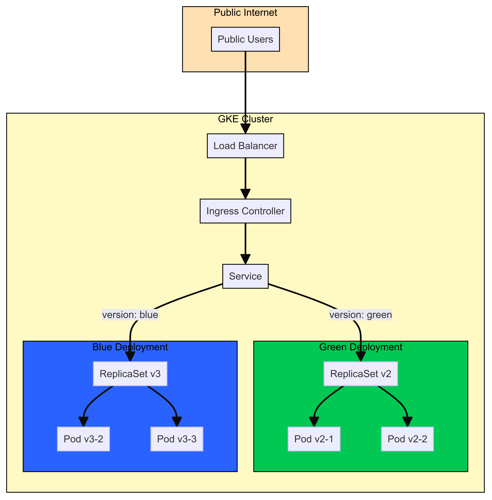
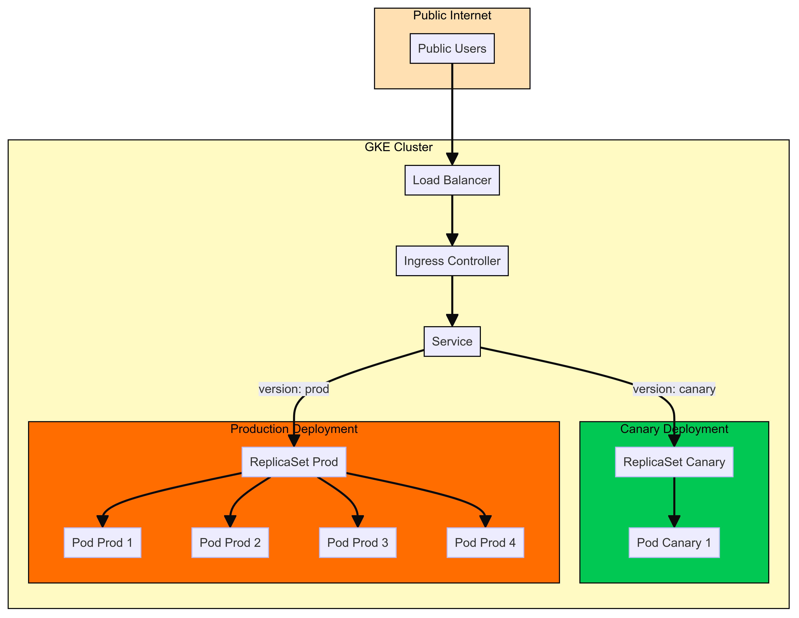
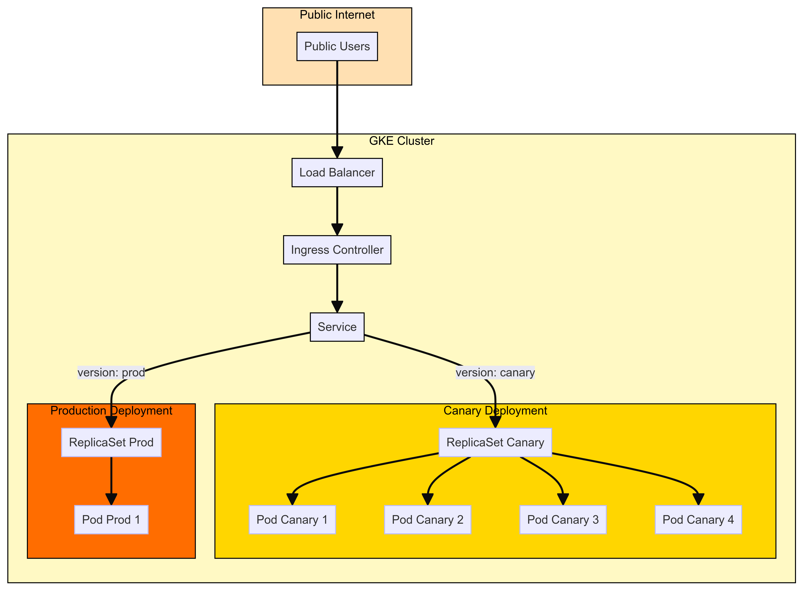

# RTFM-GKE-TUTORIAL 2

## Project Overview

### What We Learn from This Repository

This repository serves as a comprehensive demonstration of deploying a Blue/Green and Canary deployment patterns on Google Kubernetes Engine (GKE) using Kubernetes and Helm charts. By following the steps and utilizing the provided files, users will gain hands-on experience with several advanced DevOps and cloud management techniques. Here’s a breakdown of the key skills and concepts showcased in this project:

- **Deployment Strategies with Kubernetes**
    - Blue/Green Deployments
    - Canary Deployments
- **Container Orchestration with Kubernetes**
- **Google Kubernetes Engine (GKE)**
- **Application Deployment using Helm Charts**
- **Advanced Ingress and Service Management**

### Why This Project Is Important

- **End-to-End Solution**: Provides a complete example of deploying and managing applications in a cloud-native environment using Kubernetes.
- **Modern DevOps Practices**: Emphasizes on deployment patterns that enhance application availability, scalability, and reliability.
- **Scalability and Reliability**: Demonstrates how to implement scalable and reliable deployment strategies.
- **Hands-On Experience**: Offers practical experience with real-world deployment scenarios and tools.

### Application Architecture Overview

In this project, we are deploying the `podinfo` application using Kubernetes, managed through Helm charts on Google Kubernetes Engine (GKE). The application uses different deployment patterns (Blue/Green and Canary) to manage updates and releases.

### Diagram of Kubernetes Architecture

The architecture diagrams illustrate the deployment and management of the `podinfo` application using both Blue/Green and Canary deployment patterns within a GKE cluster.







### Architecture Components

- **Ingress Controller**: Manages external access to the services within the cluster.
- **Load Balancer**: Distributes incoming traffic across the available services.
- **Service**: Manages and routes traffic to different versions of the application based on deployment patterns.
- **Blue Deployment**: Represents one version of the application with its own ReplicaSet and pods.
- **Green Deployment**: Represents another version of the application with its own ReplicaSet and pods.
- **Canary Deployment**: Represents a small percentage of the traffic routed to a new version of the application for testing purposes before full deployment.

### Data Flow

1. **Public Users**: Access the application through the internet.
2. **Load Balancer**: Distributes the incoming traffic to the Ingress Controller.
3. **Ingress Controller**: Routes the traffic based on defined rules to the appropriate service.
4. **Service**: Directs the traffic to either the Blue or Green deployment (in Blue/Green deployment) or splits traffic between Production and Canary deployments (in Canary deployment).
5. **Pods**: The `podinfo` application instances running in different deployments handle the incoming requests.

This guide provides step-by-step instructions on how to set up a GCP project, create a service account, configure Kubernetes with Helm, deploy the `podinfo` application using Helm charts, and manage the application using Blue/Green and Canary deployment strategies on GKE.

## Observing Deployments and Logs

1. In the GCP Console, navigate to the Kubernetes Engine section and select your cluster.
2. Click on the "Workloads" tab to view the deployments. You should see the `podinfo-blue`, `podinfo-green`, `podinfo-prod`, and `podinfo-canary` deployments, depending on which step you are in.
3. Click on a deployment to view its details, including the number of desired and available replicas, events, and managed pods.
4. Click on a managed pod to view its details and access the container logs. The logs will show the Podinfo application's access logs, including the requests made to the application.
5. In the "Events" section of the deployment and pod details, you can see the recent events related to the resource, such as scaling events or pod status changes.
6. Use the following commands to view the deployments, pods, and events from the command line:

These commands will display the current state of the resources and any relevant events.
    
    ```
    kubectl get deployments
    kubectl get pods
    kubectl get events
    ```
    
7. To view the logs of a specific pod, use the following command:

Replace `<pod-name>` with the actual name of the pod you want to inspect.
    
    ```
    kubectl logs <pod-name>
    ```
    

By observing the deployments, pods, and logs using the GKE console and command line, you can gain insights into the behavior of your blue/green and canary deployments. Pay attention to the events and logs to understand how the deployments progress and how traffic is distributed between the different versions of the application.

## Steps

### 1. Setting Up GCP Project and Service Account

### Create a New GCP Project

1. Go to the Google Cloud Console.
2. Click on the project dropdown at the top of the page and select "New Project".
3. Enter a name for your project and click "Create".
4. Once the project is created, make note of the Project ID. You can find it on the dashboard or in the project dropdown.

### Create a Service Account

1. In the Google Cloud Console, navigate to "IAM & Admin" > "Service Accounts".
2. Click "Create Service Account".
3. Enter a name for the service account (e.g., "terraform").
4. Assign the "Editor" role to the service account.
5. Click "Done" to create the service account.
6. Click on the created service account to edit it, and then click "Add Key" > "Create New Key".
7. Choose JSON format and click "Create". Download the key file to your local machine.

### Move the JSON Key to Your Terraform Directory

Move the downloaded JSON key to the directory where your `main.tf` file is located:

```
mv ~/path/to/downloaded-key.json ~/path/to/terraform-directory/terraform-key.json
```

### 2. Setting Up Terraform

### Configure Terraform Backend

Create a unique bucket in GCS to store the Terraform state file. You can do this via the GCP Console or using the `gsutil` command. Also, create the necessary folder within the bucket:

```
gsutil mb gs://your-unique-bucket-name
gsutil mkdir gs://your-unique-bucket-name/terraform/state/file/prefix
```

### Update `main.tf` for Backend Configuration

Add the backend configuration in your `main.tf` file:

```
terraform {
  backend "gcs" {
    bucket      = "your-unique-bucket-name"
    prefix      = "terraform/state/file/prefix"
    credentials = "terraform-key.json"
  }
}
```

### Update Terraform Provider Configuration

Ensure your `provider "google"` block in `main.tf` is correctly configured:

```
provider "google" {
  credentials = file("path/to/your/terraform-key.json")
  project     = "your-project-id"
  region      = "us-central1"
  zone        = "us-central1-c"
}
```

### Initialize and Apply Terraform Configuration

1. **Initialize Terraform:**
    
    ```
    terraform init
    ```
    
2. **Reconfigure if necessary:**
    
    ```
    terraform init --reconfigure
    ```
    
3. **Apply Terraform configuration:**
    
    ```
    terraform apply
    ```
    
4. **Confirm the apply action and wait for the resources to be created.**

### 3. SSH into Google Cloud Shell

1. **Install Google Cloud SDK:**
    
    ```
    brew install --cask google-cloud-sdk
    
    ```
    
2. **Authenticate with Google Cloud:**
    
    ```
    gcloud auth login
    
    ```
    
3. **Set your Google Cloud project:**
    
    ```
    gcloud config set project your-project-id
    
    ```
    
4. **SSH into Google Cloud Shell:**
    
    ```
    gcloud cloud-shell ssh
    
    ```
    

### 4. Install Helm in Google Cloud Shell

1. **Download and Install Helm:**
    
    ```
    curl <https://raw.githubusercontent.com/helm/helm/master/scripts/get-helm-3> | bash
    
    ```
    

### 5. Authenticate with Service Account

1. **Set the environment variable for the service account key:**
    
    ```
    export GOOGLE_APPLICATION_CREDENTIALS="path/to/your/terraform-key.json"
    
    ```
    
2. **Authenticate using the service account:**
    
    ```
    gcloud auth activate-service-account --key-file=$GOOGLE_APPLICATION_CREDENTIALS
    
    ```
    
3. **Configure kubectl to use the GKE cluster:**
    
    ```
    gcloud container clusters get-credentials <your-cluster-name> --zone <your-cluster-zone> --project <your-project-id>
    
    ```
    

### 5: Install NGINX Ingress Controller

1. Add the NGINX Helm repository:
    
    ```
    helm repo add ingress-nginx https://kubernetes.github.io/ingress-nginx
    ```
    
2. Update the Helm repository:
    
    ```
    helm repo update
    ```
    
3. Install the NGINX Ingress Controller:
    
    ```
    helm install nginx-ingress ingress-nginx/ingress-nginx
    ```
    

### 6: Create Service and Ingress Resources

1. Apply the `service.yaml` file to create the service resource:
    
    ```
    kubectl apply -f service.yaml
    ```
    
2. Apply the `ingress.yaml` file to create the ingress resource:
    
    ```
    kubectl apply -f ingress.yaml
    ```
    

### 7: Blue/Green Deployment

1. Install the blue deployment using Helm:
    
    ```
    helm install podinfo-blue ./mychart --set deploymentType=blue
    ```
    
2. Access the Podinfo application using the ingress endpoint. You should see the blue version of the application with a blue background color.
3. Install the green deployment using Helm:
    
    ```
    helm install podinfo-green ./mychart --set deploymentType=green
    ```
    
4. To switch traffic from the blue deployment to the green deployment, update the service selector:
    
    ```
    kubectl patch service podinfo-service -p '{"spec":{"selector":{"version":"green"}}}'
    ```
    
5. Access the Podinfo application again. You should now see the green version of the application with a green background color.

To access the Podinfo application using the ingress hostname, you need to obtain the external IP address of the ingress controller and update your local `/etc/hosts` file.

## Accessing the Application

1. Get the external IP address of the ingress controller:

Look for the `ADDRESS` column in the output. In this example, the external IP address is `35.188.184.5`.
    
    ```
    kubectl get ingress
    ```
    
2. Open your local `/etc/hosts` file with a text editor (requires administrator privileges):
    - On Linux or macOS:
        
    ```
    sudo nano /etc/hosts
    ```
        
3. Add the following line to the `/etc/hosts` file:

Replace `35.188.184.5` with the external IP address you obtained in step 1.
    
    ```
    35.188.184.5 podinfo.example.com
    ```
    
4. Save the changes to the `/etc/hosts` file.
    - On Linux or macOS:
    Press `Ctrl+X`, then `Y`, and finally `Enter` to save the changes in `nano`.
5. Access the Podinfo application by opening a web browser and navigating to `http://podinfo.example.com`.
The hostname `podinfo.example.com` will be resolved to the external IP address of the ingress controller, and you will be able to access the application.

Note: Editing the `/etc/hosts` file requires administrator privileges. If you don't have the necessary permissions.

### 8: Canary Deployment

1. Uninstall the blue and green deployments:
    
    ```
    helm uninstall podinfo-blue
    helm uninstall podinfo-green
    ```
    
2. Install the production deployment using Helm:
    
    ```
    helm install podinfo-prod ./mychart --set deploymentType=prod
    ```
    
3. Install the canary deployment using Helm:
    
    ```
    helm install podinfo-canary ./mychart --set deploymentType=canary
    ```
    
4. Update the service selector to direct traffic to both the production and canary deployments:
    
    ```
    kubectl patch service podinfo-service -p '{"spec":{"selector":{"app":"podinfo"}}}'
    ```
    
5. Access the Podinfo application. You should see a mix of responses from the production and canary deployments.
6. To adjust the traffic distribution, update the replica counts for the production and canary deployments:
    
    ```
    helm upgrade podinfo-prod ./mychart --set deploymentType=prod --set prod.replicaCount=7
    helm upgrade podinfo-canary ./mychart --set deploymentType=canary --set canary.replicaCount=3
    ```
    
7. Access the Podinfo application again. You should now see a higher proportion of responses from the canary deployment.

## Troubleshooting

- **Check Pod Logs:**
    
    ```
    kubectl logs <pod-name>
    ```
    
- **Check Service Endpoints:**
    
    ```
    kubectl get endpoints <service-name>
    ```
    
- **Ensure Network Policies are not restricting traffic:**
    
    ```
    kubectl get networkpolicies
    ```
    
- **Describe Services and Pods for more details:**
    
    ```
    kubectl describe service <service-name>
    kubectl describe pod <pod-name>
    ```
    

By following these steps, you should be able to set up and deploy your application on GKE using Terraform and Helm, and access it via the external IP of the load balancer.
